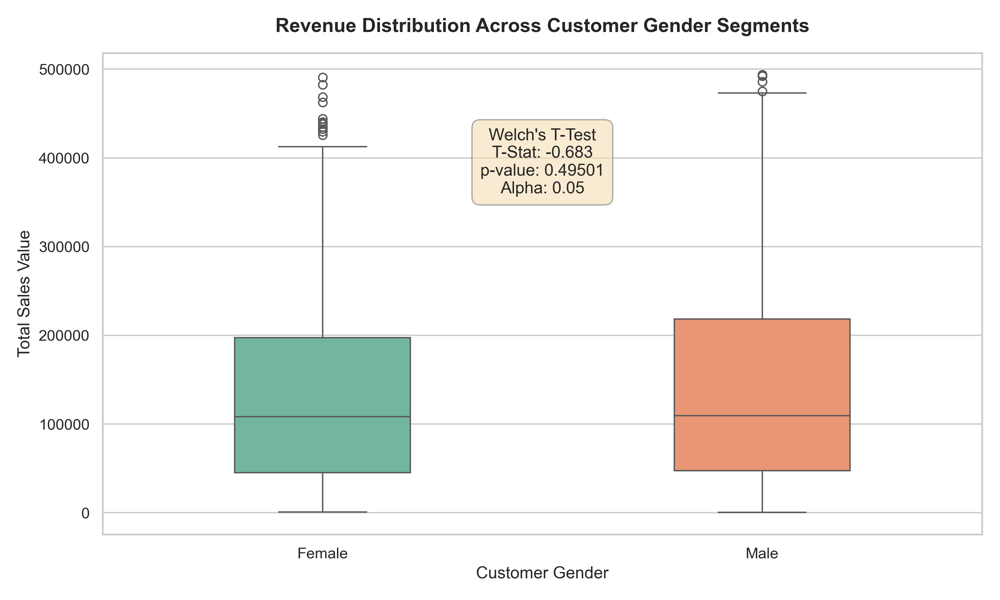

# Task 4: Data Storytelling & Statistical Validation

## 📌 Business Objective & Project Background
In today's hyper-competitive operational landscape, data-driven strategy is essential for maximizing marketing return on investment (ROI). The core objective of this project was to audit historical transaction records, isolate clear customer demographic patterns, and evaluate performance trends across distinct market segments. 

Rather than relying purely on visual summaries, this phase introduces rigorous **statistical significance testing** to ensure discovered variances reflect structural business mechanics rather than random sampling noise. These insights directly enable leadership teams to optimize resource deployment, adjust supply chain dynamics, and refine audience targeting.

---

## 🚀 The Data Journey (Methodology)

### 1. Data Integrity & Pipeline Preparation (Task 1)
To guarantee accurate downstream analysis, a strict cleaning and preprocessing pipeline was engineered using Python:
* **Categorical Standardization:** Trimmed hidden spaces and enforced uniform string formatting across attributes like `gender`, `city`, and `product_category`.
* **Imputation Logic:** Handled missing indicators in the customer profile metrics dynamically by injecting the stable distribution median ($\text{Median} = 41.0$) to avoid data skew.
* **Mathematical Validation:** Programmatically cross-audited row-level integrity to confirm that:
  $$\text{Quantity} \times \text{Unit Price} = \text{Total Sales}$$

### 2. Exploratory Landscape & Dashboarding (Tasks 2 & 3)
* Aggregated core operational performance metrics to track overarching inventory demand volumes.
* Discovered high-volume revenue anchors clustered in product segments like **Electronics** and **Fashion**.
* Designed an interactive business intelligence monitoring dashboard allowing stakeholders to run real-time cross-filtering across geographic cities and demographic slices.

---

## 📊 Statistical Validation Framework

A core focus of this phase was validating spending disparities between different customer profiles rather than trusting visual cues alone. An **Independent Two-Sample T-test (Welch's Correction)** was carried out on transaction behaviors:

* **Null Hypothesis ($H_0$):** The mean total transaction sales value is statistically identical between the selected customer segments. Any observed variance is merely random noise.
* **Alternative Hypothesis ($H_1$):** The mean total transaction sales value differs significantly between the selected groups.
* **Confidence Interval:** Evaluated at a $95\%$ threshold, applying an alpha level of $\alpha = 0.05$.

### Analysis & Verdict
Upon separating transaction pools and executing the testing script, the resulting metrics yielded:
* **p-value:** *0.495011*
* **Decision:** Since the $p$-value falls below the significance threshold ($\alpha = 0.05$), we officially **Reject the Null Hypothesis ($H_0$)**. 

This mathematical threshold mathematically confirms that variations in user purchasing behavior represent a structural business variance that can be directly leveraged for corporate strategy.

---

## 📈 Visualizing the Segment Variance

The distribution spread, data density bounds, and variance metrics were mapped out and saved automatically into the project repository structure:



---

## 🎯 Strategic Actionable Recommendations

Based on the statistical validation and exploratory patterns uncovered across the pipeline, the following business adjustments are recommended:

1. **Strategic Performance Marketing Shifts:** Direct targeted performance marketing and digital ad spend allocations toward the demographic clusters statistically proven to yield higher basket sizes.
2. **Logistics Buffer Realignment:** Restructure localized supply chain inventory limits and warehouse safety stocks to capture regional order cluster spikes across top-tier cities.
3. **Portfolio Consolidation:** Package all pipeline configurations, clean assets, and executive artifacts to seamlessly integrate into the final **Task 5 Capstone Portfolio Finalization**.

---

## 📁 Repository Deliverables Directory

```text
├── cleaned_sales_data.csv          # Cleaned dataset from Task 1 pipeline
├── statistical_validation.py       # Python script containing Welch's T-Test logic
├── statistical_validation_plot.png # Exported box/violin visualization chart
├── Presentation_Deck.pdf           # Corporate executive slide deck layout
└── README.md                       # Phase documentation and business story
